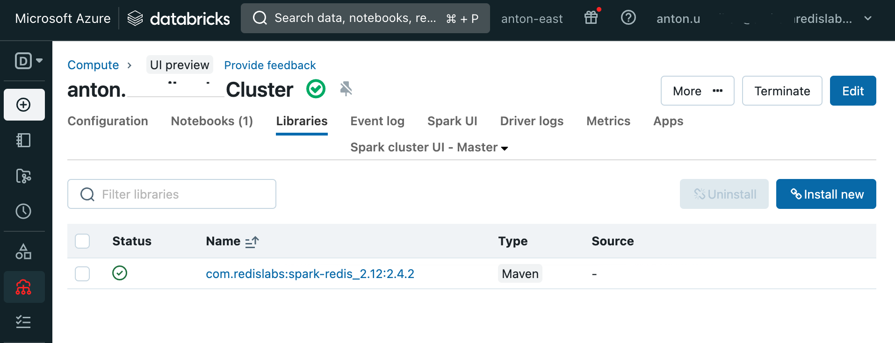
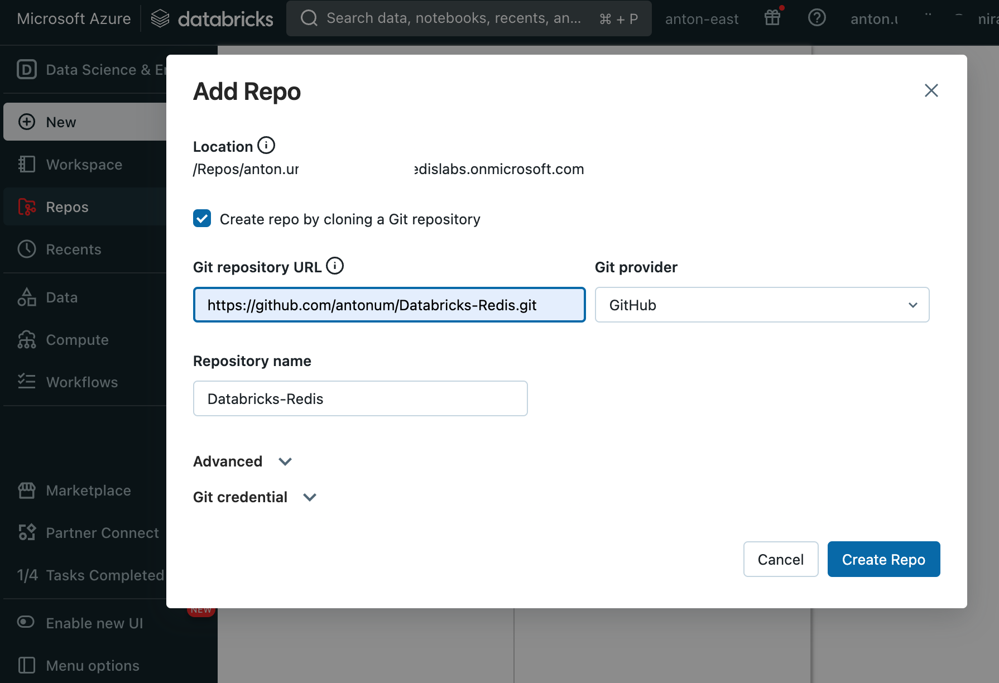
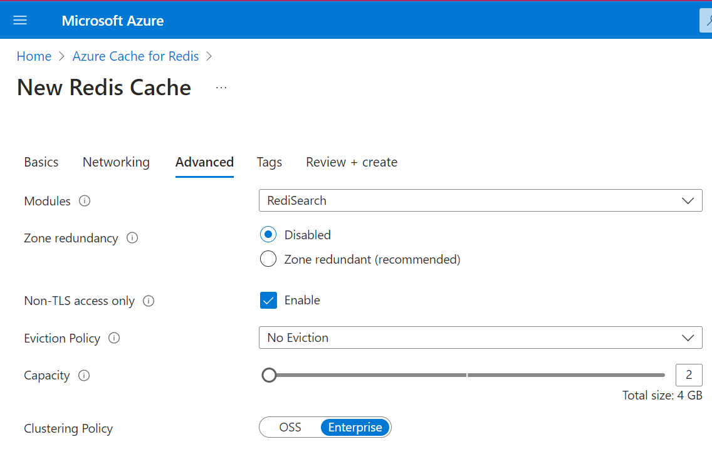

# Databricks-Redis

Example notebook loads data from build-in Databricks samples as a dataframe and then writes it into Redis database. In Redis RediSearch indices are created and queries from Python are run.

You can use this example to materialize Databricks/Spark dataframes as Redis Hashes

## Add Spark-Redis JAR file to Cluster

To add required Redis-Spark libraries to your runtime add `com.redislabs:spark-redis_2.12:2.4.2` maven library to your Cluster Libraries section. You might need to restart runtime after library was added.




## Add repo to the Workspace

In your Databricks Workspace Repos->Add Repo, enter `https://github.com/antonum/Databricks-Redis.git` as Git repository URL.



## Azure Cache for Redis Enterprise Setup

Navigate to the Azure portal and create a Azure Cache for Redis Instance. You will need to select an Enterprise tier cache (E5, E10, etc.) but E5 will suffice for this demo. 


Note that you will want to select non-TLS access as this notebook does not utilize TLS for connectivity to the cluster. Also, add the Redis Search module and ensure that the required Enterprise clustering mode is selected.  

Change the following lines in your notebook to use your own Azure Cache for Redis Enterprise endpoint and access key (password):

```python
#Replace values below with your own if using Redis Cloud instance
REDIS_HOST="cluster.region.redisenterprise.cache.azure.net"
REDIS_PORT=1000
REDIS_PASSWORD="0XKOePIFBCtuNvV6PhsXl3ysQYXXXXXX"
```

## References

- Spark-Redis https://github.com/RedisLabs/spark-redis
- Redis-py https://github.com/redis/redis-py 
- Redis Search commands: https://redis.io/commands/?group=search
- Redis Workshops https://github.com/antonum/Redis-Workshops (See `03-Advanced_RedisSearch` for advanced redis search examples)
- Azure Cache for Redis Enterprise setup https://learn.microsoft.com/en-us/azure/azure-cache-for-redis/quickstart-create-redis-enterprise

## Saving Dataframe to Redis

The following code fragment would load content of Spark dataframe to Redis as Hash keys. Key names would be `"people:1234"` where people is `table` option and 123 is a value of `id` column from `key.column` option.

```python
df.write.format("org.apache.spark.sql.redis") \
      .mode("overwrite") \
      .option("table", "people") \
      .option("key.column", "id") \
      .option("host", REDIS_HOST) \
      .option("port", REDIS_PORT) \
      .option("auth", REDIS_PASSWORD) \
      .save()
```

For more information check Spark-Redis github and documentation https://github.com/RedisLabs/spark-redis