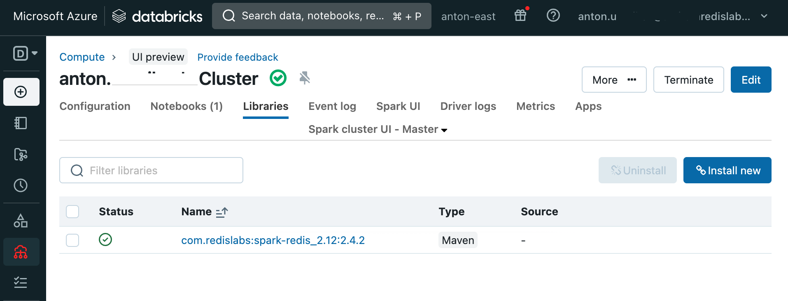

# Databricks-Redis

Example notebook loads data from build-in Databricks samples as a dataframe and then writes it into Redis database. In Redis RediSearch indices are created and queries from Python are run.

You can use this example to materialize Databricks/Spark dataframes as Redis Hashes

## Add Spark-Redis JAR file to Cluster

To add required Redis-Spark libraries to your runtime add `com.redislabs:spark-redis_2.12:2.4.2` maven library to your Cluster Libraries section. You might need to restart runtime after library was added.



## Get Free Redis Cloud account

https://redis.com/try-free/ - sign up with google account. Capture the URL, Port and default user password for the database.

## References

Spark-Redis https://github.com/RedisLabs/spark-redis
Redis-py https://github.com/redis/redis-py 
Redis Search commands: https://redis.io/commands/?group=search

## Saving Dataframe to Redis

The following code fragment would load content of Spark dataframe to Redis as Hash keys. Key names would be `f"people:{col("id")}"` where people is `table` option and `id` is `key.column` option.

```
df.write.format("org.apache.spark.sql.redis") \
      .mode("overwrite") \
      .option("table", "people") \
      .option("key.column", "id") \
      .option("host", REDIS_HOST) \
      .option("port", REDIS_PORT) \
      .option("auth", REDIS_PASSWORD) \
      .save()
```

For more information check Spark-Redis github and documentation https://github.com/RedisLabs/spark-redis